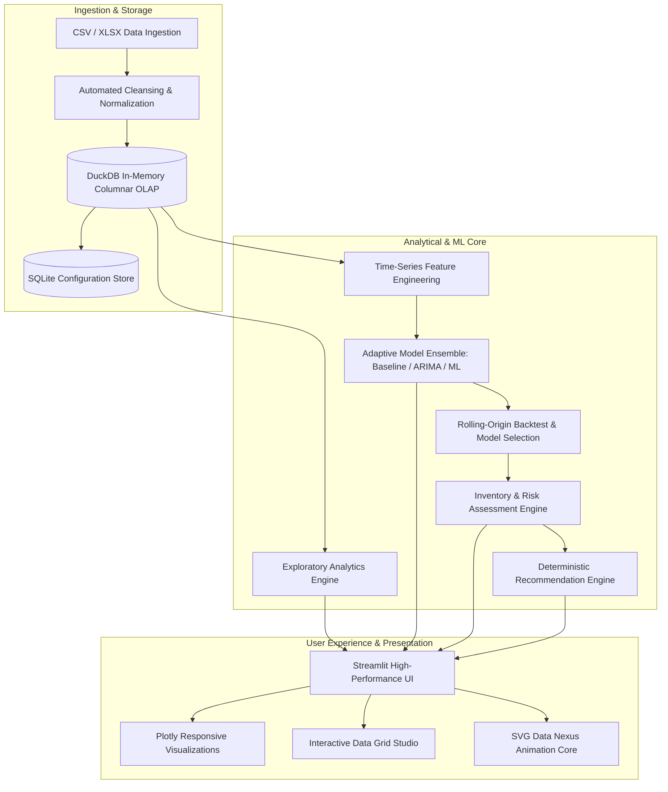

# FORESIGHT Nexus — Product Requirements Document (PRD)

**Document Version:** 2.4.0 (Enterprise SaaS Edition)  
**Product Name:** FORESIGHT Nexus  
**Tagline:** *See demand before it happens.*  
**Product Category:** AI Demand & Inventory Intelligence Platform  
**Target Audience:** Supply Chain Executives, Demand Planners, Inventory Directors, Merchandisers  
**Status:** Approved & Implemented  

---

## 1. Executive Summary & Vision

### 1.1 Product Vision
FORESIGHT Nexus is an enterprise-grade AI analytics and decision-support SaaS platform engineered to transform raw historical sales and inventory transactions into accurate multi-horizon forecasts, proactive stockout prevention signals, and explainable replenishment recommendations.

### 1.2 Core Philosophy
1. **Never Invent Data:** Every statistic, chart point, and inventory recommendation is grounded in mathematical operations executed on verified datasets — never simulated dummy figures or static mock values.
2. **Transparent Explainability:** Black-box recommendations are rejected. Every inventory reorder recommendation explicitly details the current physical stock, forecasted lead-time velocity, safety buffer, and calculated reorder point.
3. **Privacy-First Local Execution:** The platform operates locally or within an isolated enterprise virtual private cloud (VPC), utilizing an embedded DuckDB columnar analytics engine without exfiltrating sensitive commercial data to external third parties.
4. **Bespoke SaaS Visual System:** Moving beyond basic dashboard templates, FORESIGHT Nexus delivers an obsidian dark-mode interface with balanced typographic hierarchy, responsive layouts, active data grid editors, and vector-animated system telemetry.

---

## 2. Problem Statement & User Personas

### 2.1 The Core Problem
Modern retail, wholesale, and omnichannel businesses frequently suffer from two opposing operational failures:
- **Catastrophic Stockouts:** High-velocity products deplete unmonitored during demand spikes or extended supplier lead times, resulting in lost revenue, eroded customer trust, and marketplace ranking penalties.
- **Excess Capital Lockup:** Slower-moving products accumulate past reasonable holding horizons, tying up operational cash flow and incurring substantial holding costs and liquidation write-downs.
- **Spreadsheet Fragility:** Legacy supply chain management reliant on disconnected Excel workbooks lacks automated statistical anomaly detection, seasonal decomposition, and adaptive model selection.

### 2.2 Target User Personas

| Persona | Role | Key Objectives in Platform | Primary Modules Used |
| :--- | :--- | :--- | :--- |
| **Marcus Vance** | VP of Supply Chain & Operations | Portfolio health oversight, capital risk minimization, operational SLA tracking | Command Center, Alerts & Risks, Settings |
| **Elena Rostova** | Lead Demand Planner | Model calibration, cross-validation tuning, seasonal variance analysis, SKU forecasting | Forecast Studio, Model Performance, Product Explorer |
| **Julian Chen** | Inventory Controller | Stockout prevention, reorder approval, supplier lead-time management | Inventory Intelligence, Recommendations |
| **Sarah Jenkins** | Commercial Merchandiser | Promotional uplift assessment, growth leader identification, catalog rationalization | Demand Intelligence, Data Lab |

---

## 3. Technology Stack & System Architecture

### 3.1 Architectural Schematic

### 3.2 Technical Component Specifications
- **Application Runtime:** Python 3.13 (64-bit)
- **Frontend Framework:** Streamlit (v1.40+) with custom CSS Obsidian design system (`ui/css.py`)
- **Analytics Database:** DuckDB Columnar OLAP Engine (Zero-latency analytical SQL queries via `database/repositories.py`)
- **Configuration Store:** SQLite (`database/settings_store.py`) with thread-safe connection pooling
- **Time-Series Models:**
  - *Baselines:* Naive, Moving Average (7/14/28-day windows), Seasonal Naive (weekly/annual)
  - *Statistical:* Statsmodels ARIMA (p, d, q) with stationarity diagnostics and history checks
  - *Machine Learning:* Scikit-Learn Ensemble (Random Forest Regressor, Gradient Boosting, ElasticNet) with lag-features, rolling statistics, and calendar encoders
- **Data Grid Engine:** Streamlit Data Editor powered by Glide Data Grid with custom column configurations

---

## 4. Functional Requirements by Module

### 4.1 Command Center
- **System Telemetry & Status:** Display live platform status (`Intelligence Engine Active`), historical window dates, and model calibration state.
- **Ambient Vector Data Nexus:** SVG vector visual featuring animated orbital rings (`<animateTransform>`), streaming particle splines (`<animateMotion>`), and concentric radar ripples.
- **Executive KPI Matrix:** Four primary cards with status badges and context:
  1. *Catalog Monitored:* Unique active product lines
  2. *Inventory on Hand:* Total aggregate physical units in stock
  3. *Recent Demand (28d):* Trailing 28-day unit sales with period-over-period growth %
  4. *Urgent Reorders:* Count of SKUs requiring immediate purchase orders, with estimated reorder investment capital
- **Macro Demand Trajectory:** Aggregate daily demand history plotted against 30-day forward ensemble forecast with 80% confidence interval bands.
- **Imminent Stockout Radar:** Horizontal bar chart highlighting SKUs facing stockout within 14 days, including explicit zero-day footprint indicators.
- **Portfolio Health Distribution:** Donut chart segmenting catalog into Healthy, Watch, and Critical/At Risk status.
- **Executive Priority Insights:** Plain-language analytical bullets generated from live data signals.

### 4.2 Demand Intelligence
- **Velocity Metrics:** Macro metrics covering Total Units Sold, Daily Demand Velocity, Catalog Depth, and Volatility (Std Dev).
- **Macro Trend Analytics:** Interactive line charts with rolling moving average overlays.
- **Multi-Cycle Seasonality:**
  - *Day-of-Week Seasonality:* Bar chart illustrating weekly demand distribution (Monday through Sunday).
  - *Monthly Seasonality:* Cyclical monthly volume patterns across the calendar year.
- **Category Demand Breakdown:** Horizontal bar ranking of demand volume and revenue contribution by product category.
- **Growth & Decline Momentum Leaders:** Dual ranking tables separating top 5 growing SKUs from top 5 declining SKUs.

### 4.3 Inventory Intelligence
- **Portfolio Health Matrix:** Treemap and bar distributions categorizing stock into:
  - *Critical Stockout Risk:* Stock coverage < 7 days
  - *At Risk:* Stock coverage < lead time days
  - *Healthy:* Stock coverage balanced between safety stock and overstock ceiling
  - *Excess / Stagnant:* Stock coverage exceeding overstock threshold (default > 90 days)
- **Capital Lockup Estimation:** Value of inventory tied up in excess aging stock based on unit cost.
- **Velocity Profiling:** Fast Movers vs Slow Movers segmentation tables.

### 4.4 Forecast Studio
- **Product Selector:** Volume-sorted dropdown prioritizing high-velocity SKUs.
- **Parameter Controls:**
  - Forecast Horizon slider (7 to 90 days, default 30 days)
  - Model selection override (Auto-Select Best, ARIMA, Gradient Boosting, Random Forest, Moving Average, Naive)
- **Visual Trajectory:** Historical trailing demand (up to 120 days) plotted continuously into the future prediction curve, flanked by 80% confidence prediction intervals.
- **Backtesting & Cross-Validation Leaderboard:**
  - Rolling-origin backtest execution (3 folds, 14-day horizon)
  - Comparative metrics table displaying WAPE (%), RMSE, MAE, and Calibration Status
  - Plotly horizontal bar chart benchmarking error rates across evaluated model architectures
- **Tabular Forecast Schedule:** Exportable daily forecast schedule with expected, lower, and upper confidence bounds.

### 4.5 Product Explorer
- **Single-SKU 360° Profile:** Comprehensive telemetry banner with SKU identifier, category, health pill, and calibrated forecasting model.
- **Balanced Metric Grid (2x3 Layout):**
  - Current Physical Stock (units)
  - 30-Day Forward Projected Demand (units)
  - Stock Coverage Days (with stagnant infinite coverage detection)
  - Reorder Point (ROP units)
  - Safety Stock Buffer (units)
  - Recommended Order Quantity (ROQ units)
- **Depletion vs ROP Benchmark:** Historic stock on hand plotted against minimum safety reorder threshold over time.
- **Commercial Revenue Impact:** Daily commercial value generated by SKU.
- **Explainable Replenishment Card:** Narrative explanation detailing exact mathematical drivers behind replenishment advice.

### 4.6 Alerts & Risk Center
- **Statistical Anomaly Detection:** Rolling 28-day Z-score analysis flagging demand spikes (> 2.5 standard deviations above mean).
- **Stockout & Overstock Action Alerts:** Color-coded alert cards (Critical, High, Medium, Low) providing:
  - Incident Title and Category
  - Quantitative Root Cause Explanation
  - Commercial Impact Summary
  - Prescribed Operational Action Playbook
- **Anomaly Timeline:** Plotly timeline highlighting historical demand anomaly spikes with markers.

### 4.7 Replenishment Recommendations
- **Automated Purchase Order Engine:** Filterable table and cards listing all products requiring replenishment.
- **Deterministic Sizing:** Order quantity calculated as max(0, ROP - Current Stock + Lead Time Demand).
- **Executive Purchase Summary:** Total recommended units to order and estimated capital investment required.
- **Export Capabilities:** One-click CSV export of purchase recommendations for ERP ingestion (SAP, NetSuite, Dynamics).

### 4.8 Data Lab
- **Multi-Format Ingestion:** Drag-and-drop file upload supporting `.csv`, `.xlsx`, and `.xls` files with automatic Latin-1/Windows-1252 encoding fallback.
- **Semantic Schema Alignment:** Visual column mapper with automatic field guessing for required (`date`, `product_id`, `product_name`, `quantity`) and optional attributes (`category`, `price`, `revenue`, `promotion`, `supplier`, `lead_time`, `inventory`).
- **Cleansing & Hygiene Engine:**
  - Coercion and parsing of mixed date strings, ISO 8601 timestamps, and UTC offsets into uniform naive dates
  - Regex sanitation of monetary currency symbols (`$`, `€`, `£`), thousands commas, and whitespace
  - String promotion normalization (`yes`, `1`, `true`, `promo`, `active`) into verified booleans
  - Duplicate transaction aggregation on `(date, product_id)`
  - Transparent audit log surfacing every transformation applied
- **Dataset Health Scorecard:** Composite score (0-100) auditing completeness, continuity, and deduplication.
- **Interactive Promotion Scenario Studio:**
  - High-contrast interactive checkbox grid allowing users to toggle promotional flags directly in the table
  - Real-time synchronization updating active session state and DuckDB repository
  - Immediate toast confirmation feedback
- **Instant Synthetic Demo Environment:** One-click 24-month calibrated synthetic dataset across 30 SKUs with organic drift, weekly/annual seasonality, promotional shocks, and depletion cycles.

### 4.9 Model Performance
- **Cross-Validation Leaderboard:** Comprehensive leaderboard benchmarking candidate architectures across the active dataset.
- **Metric Definitions:**
  - **WAPE (%) (Weighted Absolute Percentage Error):** sum(|y - y_hat|) / sum(y) * 100
  - **RMSE (Root Mean Squared Error):** sqrt(mean((y - y_hat)^2))
  - **MAE (Mean Absolute Error):** mean(|y - y_hat|)
- **Residual Diagnostics:** Bar and scatter distributions analyzing error patterns and model bias.

### 4.10 Settings & Governance
- **Operational Parameter Tuning:**
  - Target Service Level (Z-score: 90% to 99.5%, default 95% / Z=1.65)
  - Default Supplier Lead Time (1 to 60 days, default 14 days)
  - Critical Stockout Warning Horizon (default 7 days)
  - Excess Inventory Ceiling (default 90 days)
  - Minimum History Threshold for ML Models (default 30 days)
- **Persistence:** SQLite transactional storage ensuring settings survive application restarts.

---

## 5. UI/UX Design System & Typographic Standards

### 5.1 Obsidian Color Palette
- **Deep Canvas:** `#080B11`
- **Primary Surface:** `#111622`
- **Elevated Surface:** `#161D2B`
- **Subtle Borders:** `#1F293D` / `#182233`
- **Text Primary:** `#F1F5F9`
- **Text Muted:** `#8B9BB4`
- **Text Dim:** `#64748B`
- **Brand Accent Cyan:** `#28B8FF` (Electric Cyan)
- **Brand Accent Violet:** `#8A63FF`
- **Healthy Status:** `#10B981` (Emerald)
- **Watch Status:** `#F59E0B` (Amber)
- **At Risk Status:** `#F97316` (Orange)
- **Critical Status:** `#EF4444` (Rose Red)

### 5.2 Typographic Hierarchy & Sentence Balancing
- **Single-Line Container Rule:** Hero descriptions, empty state prompts, page subtitles, and section intros must never break prematurely with orphaned 1-2 word fragments.
- **CSS Balancing Directives:** Containers utilize `text-wrap: balance;` and `text-wrap: pretty;` with expanded `max-width` (860px to 1080px), ensuring:
  - On desktop viewports, sentences flow naturally across **a single clean line**.
  - On constrained viewports, multi-line wraps break symmetrically with equal visual weight, centering second lines in empty states.

---

## 6. Data Schema Contract

| Column Name | Semantic Type | Requirement | Description & Accepted Formats |
| :--- | :--- | :--- | :--- |
| `date` | Timestamp / Date | **Mandatory** | Transaction date (`YYYY-MM-DD`, `DD/MM/YYYY`, ISO 8601). Normalized to naive date. |
| `product_id` | String / Alphanumeric | **Mandatory** | Unique SKU identifier (e.g. `1001`, `SKU-A92`). |
| `product_name` | String | **Mandatory** | Commercial product title (e.g. `Wireless Mouse`). |
| `quantity` | Numeric Float/Int | **Mandatory** | Units sold or demanded on that date (>= 0). |
| `category` | String | Optional | Merchandising category (e.g. `Electronics`, `Outdoor`). |
| `price` | Numeric Float | Optional | Unit selling price or MSRP. Sanitized from `$`, `€`, `£`. |
| `revenue` | Numeric Float | Optional | Commercial sales value on that date. |
| `promotion` | Boolean | Optional | Marketing campaign flag. Normalized from `yes`/`no`, `1`/`0`, `true`/`false`. |
| `supplier` | String | Optional | Primary vendor or manufacturer name. |
| `lead_time` | Numeric Int | Optional | Supplier replenishment lead time in days (>= 1). |
| `inventory` | Numeric Float/Int | Optional | Physical on-hand stock count at date conclusion. |

---

## 7. Non-Functional & Operational Requirements

1. **Performance:**
   - Command Center load time under 800ms on a 50,000-row catalog.
   - DuckDB aggregation queries execute in < 50ms.
   - Full ARIMA and ML backtest pipeline completes in < 3.5s per SKU.
2. **Security & Privacy:**
   - 100% on-premise execution capability.
   - Zero telemetry transmission of customer revenue, prices, or SKU names.
3. **Robustness & Error Immunity:**
   - Zero unhandled exceptions or raw Python tracebacks displayed to end users.
   - Graceful fallback: If ARIMA fails due to short history or non-stationarity, automatically fall back to Moving Average with honest UI disclosure.
4. **Browser & Responsive Compatibility:**
   - Fully tested across Chrome, Edge, Safari, and Firefox.
   - Clean responsive reflow across 1920px (Desktop), 1024px (Tablet), and 390px (Mobile).

---

## 8. Quality Assurance & Test Verification Matrix

- **Automated Test Suite:** 81 unit and integration tests passing in Pytest (`tests/`):
  - `tests/test_analytics.py`: Health classification, stockout scaling, spike detection.
  - `tests/test_arima.py`: History thresholds, fallback mechanics, backtest stability.
  - `tests/test_data.py`: Schema validation, cleaning, currency parsing, date normalization.
  - `tests/test_forecasting.py`: Feature engineering, baseline models, WAPE ranking.
  - `tests/test_inventory.py` & `test_inventory_snapshot.py`: Safety stock, ROP, coverage formulas.
  - `tests/test_recommendations.py`: Decision trees, explanation generation.
  - `tests/test_ui_system.py`: Sanitization, SVG markup, table column configurations.
  - `tests/test_utils_and_db.py`: Formatting, DuckDB OLAP queries.
- **Code Compilation:** 100% clean compilation via `compileall` with zero errors.

---

*FORESIGHT Nexus — See demand before it happens.*
