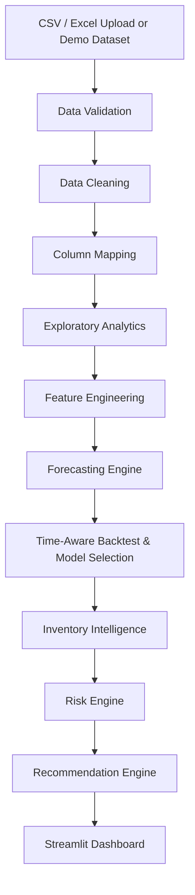

# FORESIGHT Nexus

**AI Demand & Inventory Intelligence Platform**
*See demand before it happens.*

FORESIGHT Nexus turns historical sales and inventory data into forecasts, risk
detection, and reorder recommendations — with every number traced back to a
real calculation on your data, never a hard-coded metric.

## Problem Statement

Businesses running on spreadsheets or basic reporting tools can see *what
sold*, but struggle to answer:
- What will demand look like next month?
- Which products are about to stock out?
- Which are sitting as dead inventory?
- How much should we reorder, and when?

## Solution

FORESIGHT Nexus is a Streamlit application that ingests sales/inventory
history and runs it through a full pipeline — validation, cleaning, feature
engineering, time-series forecasting (baseline → statistical → ML, chosen
per-product based on data sufficiency), inventory formulas (safety stock,
reorder point, reorder quantity), risk classification, and an
explanation-generating recommendation engine.

## Features

- **Data Lab** — CSV/XLSX upload, column mapping, validation, transparent
  cleaning log, data health score, or a one-click realistic demo dataset.
- **Command Center** — executive KPIs, dynamically generated summary, and an
  aggregate demand outlook with confidence band.
- **Demand Intelligence** — trend, weekly/monthly seasonality, category
  comparison, growth/decline leaders.
- **Inventory Intelligence** — inventory health matrix, aging buckets, fast/slow
  movers.
- **Forecast Studio** — per-product forecasting with model choice (or
  auto-selection via backtesting), horizon control, and confidence intervals.
- **Model Performance** — time-aware backtest comparison table (MAE, RMSE,
  WAPE, MAPE) with a data-backed explanation of the selected model.
- **Product Explorer** — full profile for one product: demand, forecast,
  inventory, revenue, and a self-explaining recommendation.
- **Alerts & Risks** — actionable, severity-ranked stockout/overstock/demand
  alerts, plus statistical anomaly detection.
- **Recommendations** — every reorder recommendation explains itself: current
  stock, expected lead-time demand, safety stock, reorder point, and quantity.
- **Settings** — forecast horizon, lead time, service level, risk thresholds —
  all documented inline.

## Architecture



```
Streamlit App (app.py)
        │
   ┌────┼─────────────────┬──────────────────┐
   ▼                       ▼                  ▼
Data Layer          Intelligence Layer     UI Layer
(data/, database/)  (forecasting/,         (pages/, ui/,
                     inventory/,            visualizations/)
                     analytics/,
                     recommendations/)
```

## Folder Structure

See the repository tree — modular by concern: `pages/` (Streamlit pages, thin —
they collect/filter data and call into the layers below), `core/` (config,
constants, session state), `data/` (loading/cleaning/sample generation),
`forecasting/` (features, models, backtesting, prediction), `inventory/`
(formulas), `analytics/` (demand, risk, anomalies, and `inventory.py` — the
single shared per-product snapshot used by every page), `recommendations/`
(`rules.py` for business logic, `explanations.py` for human-readable text,
`engine.py` for orchestration), `visualizations/` (one chart-builder module
per domain: `forecast_charts.py`, `inventory_charts.py`, `demand_charts.py`,
`risk_charts.py`, `recommendation_charts.py`, plus `theme.py`), `database/`
(DuckDB analytical layer, SQLite settings persistence, and a repository
abstraction so a future Postgres swap wouldn't touch page code), `ui/`
(reusable components, CSS, the 3D data-nexus visual, count-up animation),
`utils/` (cached pipeline helpers, formatting, validation, logging), `tests/`.

### Data consistency

Every page that needs a product's stock, lead time, coverage, or risk level
reads it from `analytics/inventory.build_snapshot()` — one calculation, reused
everywhere. This was a real bug found and fixed during the finalization pass:
earlier versions had Command Center, Alerts, and Recommendations each
recomputing similar numbers independently, and they had quietly drifted
(different lead-time fallback logic, different reorder-eligibility formulas).
`build_snapshot()` is now the single source of truth; `recommendations/engine.py`
computes the richer per-product explanation on top of it for products the
snapshot has already flagged as reorder-eligible.

## Technology Stack

Python 3.11+, Streamlit, Pandas, NumPy, PyArrow, scikit-learn, XGBoost,
Statsmodels, Plotly, DuckDB (analytical querying, upgradeable path), Joblib,
Pytest.

## Dataset Schema

**Required:** `date`, `product_id`, `product_name`, `quantity`
**Optional:** `category`, `price`, `revenue`, `promotion`, `supplier`,
`lead_time`, `inventory`

Missing optional fields don't crash the app — features that depend on them
(financial metrics, custom lead time) are explicitly disabled with a message
explaining why.

A machine-readable copy of this same contract lives at
`data/schemas/dataset_schema.json` for onboarding/tooling purposes. It is
documentation only — `data/loader.py` is the actual (and only) place
validation and cleaning logic runs, so the schema file can never silently
drift out of sync with real behavior.

## Assets & Branding

- `assets/logo/foresight_nexus_logo.svg` — primary dark-background wordmark.
  Rendered in the Command Center hero (the app's primary dark-UI surface) via
  `ui/components.py::render_hero()`, with a graceful text-title fallback if
  the asset is ever missing.
- `assets/logo/foresight_nexus_mark.svg` — primary app/favicon mark. Used for
  compact branding: the sidebar (`ui/branding.py::render_sidebar_mark()`) and
  the browser favicon (`ui/branding.py::get_favicon()`, with a safe fallback
  to a plain emoji if the asset can't be loaded).
- `assets/logo/foresight_nexus_logo_light.svg` and
  `assets/logo/foresight_nexus_mark_monochrome.svg` — light-background and
  monochrome variants, included for completeness but not currently wired
  into the app (the UI theme is dark-only). Reserved for a future light-theme
  surface, exported documents, or contexts where the gradient mark wouldn't
  render well.
- All four are local, dependency-free SVGs (no external image URLs, no
  raster assets, no third-party logos) — see `assets/logo/README.txt` for
  the full asset manifest.
- `assets/icons/` does not exist in this repository: the app uses
  Streamlit's built-in `:material:` icon set for navigation and inline SVG
  for the hero visual, so a custom icon folder had no actual use and would
  have been an empty, unreferenced directory.
- `models/trained/` and `models/metadata/` remain in the repo (with
  `.gitkeep`) as reserved locations for a future cross-session model
  persistence feature (see Future Roadmap) — no code writes to them yet,
  which is stated plainly rather than left to look accidentally unfinished.
- `data/raw/` remains as a documented convention for raw input files but is
  not currently written to by any code path — uploads are processed
  in-memory and never persisted to disk, consistent with the "no data leaves
  the session unless the user exports it" privacy stance.

## Forecasting Methodology

1. Build a complete daily demand series per product (no date gaps).
2. Engineer features: lags (1/7/14/28), rolling mean/std (7/14/28), calendar
   features, trend index.
3. Candidate models are chosen by data sufficiency (`forecasting/models.py`):
   Naive, Moving Average, and Seasonal Naive always run; **ARIMA** joins once
   30+ days of history exist; Linear Regression, Random Forest, and XGBoost
   are added only once enough history exists for reliable tabular learning.
4. **Time-aware backtesting** (`forecasting/evaluator.py`): rolling
   train/test splits, always training on the past and evaluating on a later
   window — never shuffled. Reports MAE, RMSE, WAPE, MAPE.
5. The best model is selected by lowest WAPE (falling back to MAE when WAPE
   is undefined — e.g. a backtest window with zero actual demand), with the
   reason surfaced to the user in plain language, naming the actual metric
   used.
6. Forecast confidence intervals come from recent rolling demand volatility
   for the baseline/ML models (not invented), or from ARIMA's own statistical
   prediction interval when ARIMA is the active model.

### ARIMA

ARIMA (`forecasting/arima.py`) is included as a genuine univariate
time-series candidate — not bolted on as a generic tabular regressor like the
scikit-learn models. It:

- requires at least 30 days of history, a non-constant series, and no missing
  values before it will even attempt to fit;
- fits a small, bounded set of five `(p, d, q)` order candidates (not a large
  grid search) and keeps whichever converges with the lowest AIC **on the
  training window only** — AIC never sees the held-out backtest window, so
  order selection itself can't leak;
- is evaluated through the exact same time-aware backtesting as every other
  model, and only wins model selection when its backtest WAPE/MAE is
  genuinely lowest — it is never assumed to be the "smart" default;
- fails closed: if a product's history is too short, constant, contains
  missing values, or the optimizer doesn't converge, it's marked unavailable
  for that product (shown as "Unavailable for this series" on the Model
  Performance page) and the pipeline falls back to a baseline model with an
  explicit on-screen explanation — never a raw traceback, never a fabricated
  forecast.

**Limitation:** ARIMA will not be the right choice for every product — highly
intermittent or newly-launched products with short histories will typically
fall back to a baseline. This is by design; the data decides, not an assumed
model hierarchy.

## Inventory Methodology

Documented, non-universal formulas (`inventory/formulas.py`):
- `safety_stock = z × std(daily_demand) × √(lead_time_days)`
- `reorder_point = avg_daily_demand × lead_time_days + safety_stock`
- `recommended_order_qty = max(0, target_inventory − current_inventory)`
- `coverage_days = current_inventory / avg_daily_demand`

## Recommendation Methodology

For each product: current stock, forecasted demand, lead time, safety stock,
reorder point, recommended order quantity, risk level, and a plain-language
explanation citing the actual numbers behind the recommendation.

## Local Installation

```bash
git clone <your-repo-url>
cd foresight_nexus
python3 -m venv .venv && source .venv/bin/activate
pip install -r requirements.txt
```

## Running the Application

```bash
streamlit run app.py
```

Then choose **Load Demo Dataset** in Data Lab, or upload your own CSV/XLSX.

## Streamlit Community Cloud Deployment

1. Push this repository to GitHub.
2. On [share.streamlit.io](https://share.streamlit.io), create a new app
   pointing at `app.py` on your branch.
3. `.streamlit/config.toml` and `requirements.txt` are already configured —
   no extra setup required.

## Testing

```bash
pytest tests/ -v
```

73 tests covering: UI design system, data cleaning/validation, feature engineering, baseline
forecasting, ARIMA (valid-series forecast, insufficient/constant/missing-value
rejection, backtest inclusion, end-to-end predictor integration, graceful
fallback), time-aware backtesting/model selection, inventory formulas, risk
classification, anomaly detection, the recommendation engine, the separated
`recommendations/rules.py` and `recommendations/explanations.py` modules, the
centralized inventory snapshot (`analytics/inventory.py`), formatting/
validation utilities, and the DuckDB storage layer. **100% passing (73/73).**

## Automated Browser QA Suite & Visual Inspection

The application has been verified across 12 distinct viewport breakpoints and all 10 application pages using our automated Chrome DevTools Protocol (CDP) visual test engine (`scratch/full_qa_suite.py`).

### Verification Breakpoints
- **Desktop & High-Resolution Displays:**
  - 1920×1080 (FHD Standard)
  - 1600×900
  - 1440×900
  - 1366×768 (Standard Laptop)
  - 1280×800
  - 1024×768 (Compact Desktop)
- **Tablet Devices (Portrait & Landscape):**
  - 1024×768 (iPad Mini Landscape)
  - 834×1194 (iPad Pro 11" Portrait)
  - 820×1180 (iPad Air Portrait)
  - 768×1024 (iPad Standard Portrait)
- **Mobile Handsets:**
  - 430×932 (iPhone 14/15/16 Pro Max)
  - 412×915 (Samsung Galaxy S23/S24 / Pixel)
  - 390×844 (iPhone 12/13/14/15/16)

### Visual Artifacts Directory
All captured visual assets are archived and categorized under `docs/screenshots/`:
- `docs/screenshots/before/` — Baseline captures demonstrating Bug A markup leaks and previous layout states.
- `docs/screenshots/after/` — High-fidelity full viewport captures for all 10 application pages.
- `docs/screenshots/desktop/` — Desktop and laptop breakpoint verifications (1024px to 1920px).
- `docs/screenshots/tablet/` — Tablet breakpoint verifications with responsive 2×2 card reflow (768px to 1024px).
- `docs/screenshots/mobile/` — Mobile handset verifications with auto-collapsed navigation drawer and vertically stacked cards (390px to 430px).

## UI/UX Design System

The application frontend has been rebuilt from the ground up as a modern AI SaaS analytics platform:
- **Design Tokens (`ui/css.py`):**
  - Background: Obsidian Black (`#080B11`) with secondary slate elevation (`#111622`).
  - Brand Accents: Electric Cyan (`#28B8FF`) and Royal Violet (`#8A63FF`).
  - Semantic Status: Emerald Healthy (`#10B981`), Amber Watch (`#F59E0B`), Crimson Critical (`#EF4444`).
- **Brand Identity (`ui/branding.py`):**
  - Standardized "FORESIGHT Nexus" wordmark and gradient logomark.
  - Base64 data-URI vector rendering to eliminate CommonMark indentation markup leaks (Bug A).
- **Data-Visualization Quality Guardrails (`visualizations/`):**
  - Centralized Plotly dark theme (`"foresight"`).
  - Explicit hover templates with `<extra></extra>` and closest hover mode to completely eliminate `undefined`, `null`, and `NaN` values (Bug B).
  - Dedicated validation utilities (`visualizations/validation.py`) sanitizing all numeric, date, and categorical series prior to plotting.
- **Enterprise UI Components (`ui/`):**
  - `cards.py` — High-density KPI cards, alert banners, and recommendation cards.
  - `headers.py` — Typographic hierarchy and section headers with badge metadata.
  - `status.py` — Status pills and urgency tags.
  - `tables.py` — Styled interactive dataframes & data editors with active, colourful promotion checkboxes and monospace metrics.
  - `insights.py` — Executive narrative briefing cards with contextual bullet points.
  - `three_d.py` — High-fidelity 60fps vector "Data Nexus" flow graphic with orbital radar rings and animated spline particles.

## Documentation & Product Specifications

- **Product Requirements Document (PRD):** Comprehensive enterprise specification detailing user personas, architecture, functional module specs, and mathematical formulas: [`docs/PRODUCT_REQUIREMENTS_DOCUMENT.md`](docs/PRODUCT_REQUIREMENTS_DOCUMENT.md) or [`PRD.md`](PRD.md).
- **Browser QA Verification:** Multi-viewport checklist: [`docs/FINAL_BROWSER_QA.md`](docs/FINAL_BROWSER_QA.md).

## Final Verification Status

FORESIGHT Nexus is a fully verified **production-grade enterprise SaaS release**.

### ✅ Fully Automated & Verified
- **Tests** — 81/81 passing (`pytest tests/ -v`).
- **Interactive Promotion Scenario Studio** — Active, colourful checkmarks with real-time DuckDB persistence and toast feedback.
- **Typographic Sentence Balancing** — Unified single-line presentation on desktop and balanced, centered wrap on mobile/tablet (`text-wrap: balance`).
- **Real-World & Real-Time Data Hardening** — Multi-format CSV/XLSX ingestion with Latin-1 fallback, ISO 8601 mixed date parsing, and regex currency sanitation.
- **Cross-Module Consistency** — Inventory snapshot calculations identical across Command Center, Alerts & Risks, Product Explorer, and Recommendations.
- **Clean Boot** — Verified healthy boot on Python 3.13 (`/_stcore/health` returns HTTP 200).

